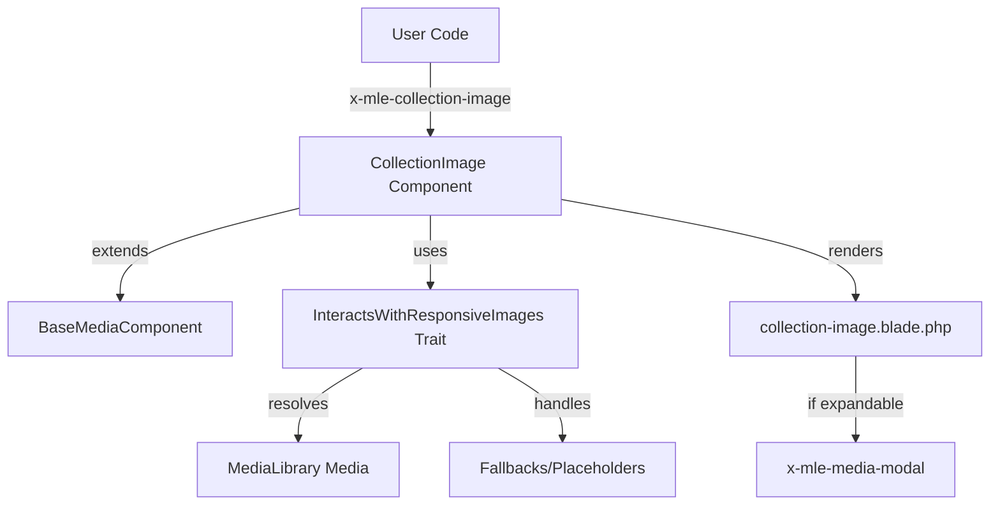

# Requirements

### Overview & Goals
Create a new Blade component that displays a responsive image from a specific model's collection. This component will be a specialized version of `image-responsive` that simplifies the common use case of displaying the "main" or "first" image of a model's collection without needing to manually fetch the `Media` object.

### Proposed Name: `CollectionImage`
We recommend naming the component **`CollectionImage`** (tag: `<x-mle-collection-image />`).
- **Why?** It is concise and clearly distinguishes it from `ImageResponsive` (which takes a direct `Media` object) and `MediaGallery` (which shows multiple images from a collection). It follows the naming pattern where the source (Collection) precedes the type (Image).

### Scope
- **In Scope**:
    - New component `CollectionImage` inheriting from `BaseMediaComponent`.
    - Support for responsive images (srcset/sizes).
    - Support for media conversions.
    - Automatic fallback to collection-defined fallbacks or global placeholders (consistent with `ImageResponsive`).
    - Integration with the media modal (expandable).
    - Preservation of existing `ImageResponsive` functionality via refactoring.
- **Out of Scope**:
    - Modifying existing `image-responsive` behavior (other than internal refactoring).
    - Handling multiple media items (use `MediaGallery` for that).

### User Stories
- As a developer, I want to display a model's featured image using a simple tag like `<x-mle-collection-image :model="$post" collection="featured" />` instead of having to resolve the media object manually.
- As a developer, I want the image to automatically handle responsive breakpoints and fallbacks if the image is missing.

# Technical Design

### Current Implementation
The existing `ImageResponsive` component handles both direct `Media` objects and model/collection pairs, but its API is cluttered because it prioritizes the `medium` prop. It manually handles model resolution instead of using the existing `BaseMediaComponent` infrastructure.

### Proposed Changes

#### 1. Shared Trait: `InteractsWithResponsiveImages`
To avoid code duplication, we will extract the core responsive image logic into a new trait.
- **Location**: `src/Traits/InteractsWithResponsiveImages.php`
- **Responsibilities**:
    - Determining the correct conversion to use.
    - Generating the `srcset` and `url`.
    - Building cache-busted URLs.
    - **Placeholder Handling**: 
        - If no media URL is available, it resolves the placeholder in the following priority:
            1. User-provided `placeholder` prop.
            2. Model's `getFallbackMediaUrl` for the specific collection.
            3. Global `medialibrary-extensions.placeholder_url` configuration.

#### 2. Component Class: `CollectionImage`
A new component that focuses on the model/collection use case.
- **Location**: `src/View/Components/CollectionImage.php`
- **Class Signature**: `class CollectionImage extends BaseMediaComponent`
- **Key Traits**: `InteractsWithOptionsAndConfig`, `InteractsWithResponsiveImages`
- **Constructor Parameters**:
    - `modelReference` (passed to `BaseMediaComponent`)
    - `collection` (string, default: 'default')
    - `conversion`, `conversions`, `sizes`, `lazy`, `alt`, `originalOnly`, `options`, `placeholder`, `expandableInModal`, `dataSource`.

#### 3. View: `collection-image.blade.php`
A new Blade view that reuses the same markup patterns as `image-responsive.blade.php`.
- **Location**: `resources/views/components/collection-image.blade.php`
- **Identity**: Uses the Base ID architecture from `BaseComponent` for stable DOM IDs and modal triggers.

### Architecture Diagram

# Testing

### Validation Approach
We will use Pest to verify the component renders correctly under various conditions.

### Key Scenarios
- **Model with Image**: Verify that passing a model and collection correctly renders the first image with responsive attributes.
- **Model without Image**: Verify that the component correctly shows the fallback image defined on the model or the global placeholder.
- **Conversions**: Verify that specifying a conversion correctly updates the `src` and `srcset` to point to the converted version.
- **Expandable**: Verify that the modal trigger and `x-mle-media-modal` are correctly rendered when `expandableInModal` is true.

### Edge Cases
- **Invalid Collection**: Ensure the component handles non-existent collections gracefully (showing fallbacks).
- **Missing Model**: Ensure the component doesn't crash if the model resolution fails (showing placeholder).
- **Empty Collection**: Verify behavior when a collection exists but has no media.

# Delivery Steps

### * Step 1: Extract responsive image logic into a shared trait
Create a new trait `Mlbrgn\MediaLibraryExtensions\Traits\InteractsWithResponsiveImages` to encapsulate the logic for generating URLs, srcsets, and handling fallbacks for responsive images.
- Move `hasGeneratedConversion`, `getUseConversion`, `buildCacheBustedUrl`, and `getFallbackConversion` from `ImageResponsive` to the trait.
- Refactor `ImageResponsive` to use this trait.
- Ensure all dependencies (like `buildCacheBustedUrl` using `Throwable`) are correctly handled in the trait.

###   Step 2: Implement the CollectionImage component class
Create the `CollectionImage` class extending `BaseMediaComponent` and using the new `InteractsWithResponsiveImages` trait.
- Implement the constructor to accept `modelReference` and a single `collection` string, along with other responsive image props (conversion, sizes, etc.), but EXCLUDE the `medium` prop.
- Implement the `render` method to resolve the first media from the specified collection and use the trait's logic to prepare the view data.
- Register the component in the package service provider if necessary (though Laravel 10+ discovery might handle it, the package likely registers its components explicitly).

###   Step 3: Create the CollectionImage Blade view
Create the Blade view for the new component, ensuring it renders a responsive image with full fallback support.
- The view should mirror `image-responsive.blade.php` to maintain consistency in HTML structure and CSS classes.
- Ensure the `` tag correctly handles `src`, `srcset`, and `sizes`.
- Add the `@elseif ($placeholder)` block to render the fallback image when the main media is missing.
- Include the `x-mle-media-modal` component at the bottom, gated by `$expandableInModal`.

###   Step 4: Add tests for the CollectionImage component
Create feature tests in `packages/mlbrgn/laravel-medialibrary-extensions/tests/Feature/View/CollectionImageTest.php`.
- Test rendering with a valid model and collection.
- Test fallback behavior when no media exists:
    - Verify it uses the `placeholder` prop if provided.
    - Verify it uses the model's `getFallbackMediaUrl` if defined.
    - Verify it falls back to the global config placeholder.
- Test responsiveness (srcset/sizes) and conversions.
- Verify that the `medium` prop cannot be passed or is ignored.