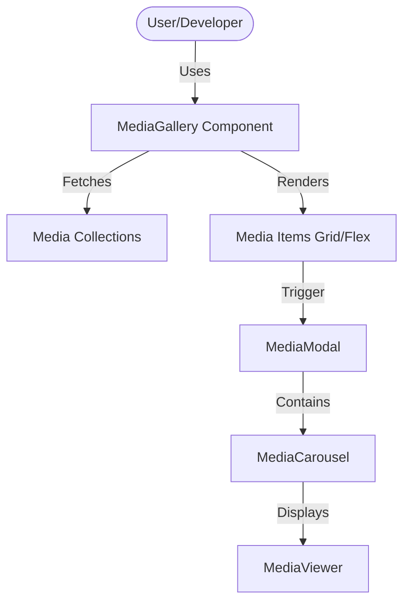

# Requirements

### Overview & Goals
The goal is to add a top-level `MediaGallery` component to the `laravel-medialibrary-extensions` package. This component will provide a clean, configurable way to display media from one or more collections associated with a single model. It will support both Grid and Flexbox layouts and integrated modal expansion for a better user experience.

### Scope
- **In Scope:**
    - New `MediaGallery` component class and Blade views.
    - Support for single or multiple media collections.
    - Configurable CSS Grid and Flexbox layouts.
    - Modal expansion using the existing `MediaModal` and `MediaCarousel` components.
    - Support for both `bootstrap-5` and `plain` themes.
- **Out of Scope:**
    - Media management features (uploading, deleting, editing) within the gallery itself.
    - Selection logic (e.g., checkboxes for multiple selection) unless explicitly requested later.

# Technical Design

### Current Implementation
The package currently provides internal components like `MediaPreviews` and `MediaPreviewGrid` primarily used within the `MediaManager`. While functional, these are tightly coupled with management features (menus, forms). There is no dedicated public-facing gallery component that offers flexible layout configuration.

### Proposed Changes
- **New Component: `MediaGallery`**
    - **Class:** `Mlbrgn\MediaLibraryExtensions\View\Components\MediaGallery`
    - **Attributes:**
        - `layout`: `grid` | `flex` (default: `grid`)
        - `columns`: Number of columns for grid layout (default: 3)
        - `gap`: CSS gap value (default: `1rem`)
        - `expandable`: Boolean to enable/disable modal expansion (default: `true`)
    - **Logic:** Aggregates media from one or more collections, sorted by priority.

- **Styles:**
    - New SCSS file `resources/css/shared/_media-gallery.scss` to handle layout logic using CSS variables for high configurability.
    
- **Modal Integration:**
    - Each media item in the gallery will act as a trigger for the `MediaModal`.
    - Correct `data-bs-slide-to` attributes will ensure the modal opens the specific item clicked.

### Architecture Diagram

### File Structure
- `src/View/Components/MediaGallery.php`
- `resources/views/components/bootstrap-5/media-gallery.blade.php`
- `resources/views/components/plain/media-gallery.blade.php`
- `resources/css/shared/_media-gallery.scss`

# Testing

### Validation Approach
I will verify the component's functionality by inspecting the generated HTML and styles, ensuring it follows the established patterns in the codebase.

### Key Scenarios
- **Single Collection Display:** Verify that media from a single collection is rendered correctly.
- **Multi-Collection Display:** Verify that media from multiple collections is aggregated and sorted.
- **Grid Layout:** Ensure `display: grid` is applied with the correct number of columns and gaps.
- **Flexbox Layout:** Ensure `display: flex` is applied with appropriate wrapping and gaps.
- **Modal Expansion:** Confirm that clicking an item opens the `MediaModal` at the correct slide.
- **Theme Switching:** Verify that both `bootstrap-5` and `plain` themes render as expected.

# Delivery Steps

### ✓ Step 1: Implement MediaGallery PHP component class
Create the new `MediaGallery` component class in `src/View/Components/MediaGallery.php`.
- Inherit from `BaseMediaComponent` for automatic model and collection resolution.
- Use `InteractsWithOptionsAndConfig` for unified configuration management.
- Implement media fetching logic that aggregates media from one or more specified collections.
- Define properties for `layout`, `columns`, `gap`, and `expandable`.

### ✓ Step 2: Implement Blade views for MediaGallery component
Create the Blade views for the `MediaGallery` component in both Bootstrap 5 and Plain themes.
- Create `resources/views/components/bootstrap-5/media-gallery.blade.php`.
- Create `resources/views/components/plain/media-gallery.blade.php`.
- Implement a flexible layout container that uses Grid or Flexbox based on configuration.
- Iterate through media items, rendering them using `x-mle-media-viewer`.
- Include modal trigger attributes (data-bs-toggle, data-bs-target, data-bs-slide-to) on each item wrapper.
- Add the `x-mle-media-modal` component at the end of the view if expansion is enabled.

### ✓ Step 3: Implement and integrate MediaGallery styles (SCSS)
Add the necessary SCSS for the new gallery component and integrate it into the project.
- Create `resources/css/shared/_media-gallery.scss` with classes for grid and flexbox layouts using CSS variables.
- Import the new SCSS file in `resources/css/bootstrap-5.scss` and `resources/css/plain.scss`.
- Ensure responsive behavior for the grid layout (e.g., adjusting columns on smaller screens).

### ✓ Step 4: Register MediaGallery component in Service Provider
Register the new `MediaGallery` component in the `MediaLibraryExtensionsServiceProvider`.
- Add the registration line in the `boot` method: `Blade::component($this->packageNameShort.'-media-gallery', MediaGallery::class);`.
- Ensure the new component is correctly namespaced and available for use in the project.

### ✓ Step 5: Update / Follow-up
make sure to test the new funtionality using pest tests and pest browser tests