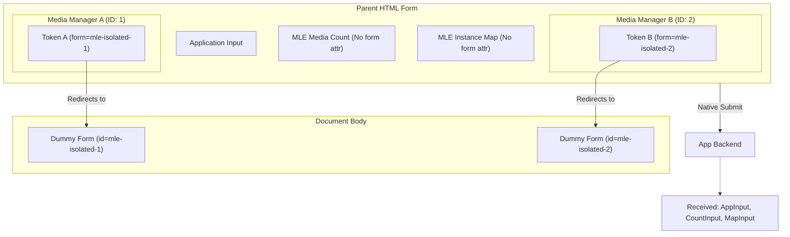

# Requirements

### Overview & Goals
The goal is to automatically isolate Media Library Extensions (MLE) components when they are nested inside a parent `<form>`. By default, internal MLE inputs (like tokens, instance IDs, and file inputs) will be redirected to a hidden dummy form using the HTML `form` attribute. 

This plan expands on Method 3 to support **multiple instances** and ensures a **comprehensive scan** of all components and partials. It also addresses browser compatibility, non-JavaScript scenarios, and robust **validation support** when multiple managers are present.

### Scope
- **In Scope**:
    - Automatic redirection of all internal MLE inputs to a unique hidden form.
    - Support for multiple Media Managers and Media Labs on the same page and within the same form.
    - Zero-configuration implementation.
    - Preservation of "media count" input for parent form validation.
    - Automated metadata mapping for backend validation rules.
    - Comprehensive Pest and Browser (Playwright) testing.
- **Out of Scope**:
    - Supporting native form submission for MLE components when JavaScript is disabled (they will remain isolated/dormant).
    - Supporting browsers without the `form` attribute (IE9 and below).

### User Stories
- As a developer, I want to place multiple Media Managers inside one large form without their internal fields (like `client_token`) polluting my application's POST data.
- As a developer, I want the "media count" validation to still work natively even when internal fields are isolated.

# Technical Design

### Current Implementation
MLE components use a mix of `
` (for XHR) and `<form>` (for native) via the `conditional-form` component. When placed inside a parent form, even the `
` based inputs are natively submitted because they are physically nested.

### Key Decisions
1.  **Unique Isolation IDs**: Every component instance (Manager or Lab) will generate a unique `isolationFormId` based on its internal `id` (e.g., `mle-isolated-{{ $id }}`). This prevents collisions when multiple managers are present.
2.  **JS-Driven Dummy Form**: To maintain "Zero Configuration," a hidden dummy form will be injected into `document.body` via JavaScript. This avoids the need for `@stack` or manual layout changes.
3.  **Validation Metadata Mapping**: Since `instanceId` is isolated, we will provide a minimal `mle_instance_map[{{ $name }}] => {{ $instanceId }}` hidden input in the parent form. This allows validation rules (`MinMediaCount`, `MaxMediaCount`) to correctly identify which component instance they are validating without polluting the request with the entire `mle_instance_ids[]` array.
4.  **Manual XHR Selection**: The `getFormData` helper in `form.js` uses `element.querySelectorAll('input')`, which ignores the `form` attribute. This ensures AJAX continues to work perfectly while native submission is redirected.
5.  **Graceful Degradation (No-JS)**: If JS is disabled, the dummy form won't be created. The browser will see `form="non-existent-id"` and will **not** submit the isolated inputs with the parent form. This achieves the primary goal of isolation, though MLE native features will be disabled.
6.  **Modern Browser Target**: We target IE10+ (browsers supporting the `form` attribute). For older browsers, isolation will simply not occur, which is an acceptable fallback for this modern package.

### File Structure & Changes

#### PHP Core
- **`src/View/Components/BaseComponent.php`**: Add `isolationFormId` to the `renderView` data.
- **`src/Rules/MinMediaCount.php`** & **`MaxMediaCount.php`**: Update to check `request()->input("mle_instance_map.{$attribute}")` if no `instanceId` is explicitly provided.

#### JavaScript
- **`resources/js/shared/media-manager-submitter.js`**: Implement `ensureIsolationForm()` to inject the dummy form on initialization.
- **`resources/js/shared/media-lab-submitter.js`**: Add similar injection logic for Media Lab instances.

#### Blade Templates (The Isolation Targets)
The following files will be updated to apply `form="{{ $isolationFormId }}"` to all internal inputs:
- `resources/views/components/plain/media-manager.blade.php` (and Bootstrap 5 version)
- `resources/views/components/plain/media-lab.blade.php` (and Bootstrap 5 version)
- `resources/views/components/plain/partial/upload-form.blade.php`
- `resources/views/components/plain/partial/youtube-upload-form.blade.php`
- `resources/views/components/plain/partial/destroy-form.blade.php`
- `resources/views/components/plain/partial/media-restore-form.blade.php`
- `resources/views/components/plain/partial/set-as-first-form.blade.php`
- `resources/views/components/plain/partial/image-editor-form.blade.php`

*Note: The input named `{{ $name }}` (media count) and the new `mle_instance_map` will NOT receive the isolation attribute.*

### Architecture Diagram

# Testing Plan

### Validation Approach
I will verify that multiple components can co-exist and that isolation is complete without breaking existing XHR features or backend validation.

### Key Scenarios
1.  **Multi-Instance Isolation**: Place two Media Managers in one form. Submit the form and verify that neither manager's `client_token` or `mle_instance_ids` appear in the request, but BOTH managers' media counts and instance mappings are present.
2.  **Independent Min/Max Validation**: Set different min/max requirements for two managers in the same form. Verify that one can fail validation while the other passes, confirming the metadata mapping works.
3.  **Media Lab Integration**: Verify that `MediaLab` internal fields are also successfully isolated.
4.  **XHR Functionality**: Ensure that clicking "Upload" or "Delete" still triggers the correct AJAX request with all necessary fields.
5.  **No-JS Simulation**: Manually disable JS and verify that MLE fields are NOT submitted with the parent form.

### New Tests to Add
- **Pest (Feature)**: `tests/Feature/Components/FormIsolationTest.php` - Verifies the presence of `form` attributes and the `mle_instance_map`.
- **Browser (Playwright)**: `tests/Browser/MultiManagerIsolationTest.php` - Verifies native submission payloads and independent validation logic for multiple instances.

# Delivery Steps

### ✓ Step 1: Implement unique isolation ID generation and metadata mapping in PHP
Update `BaseComponent.php` and validation rules to support isolation and multi-instance validation.

- Update `BaseComponent::renderView` to include `isolationFormId => 'mle-isolated-' . $this->id` in the `$data` array.
- Update `MinMediaCount.php` and `MaxMediaCount.php` to resolve `instanceId` from `mle_instance_map` in the request if not explicitly provided.
- Create `tests/Feature/Components/FormIsolationTest.php` to verify these changes.

### ✓ Step 2: Implement JS-managed isolation targets for Managers and Lab
Update the JS submitters to automatically manage the dummy isolation forms in the DOM.

- Update `media-manager-submitter.js` to read `isolationFormId` from the config and append a hidden form to `document.body` if it doesn't exist.
- Apply the same logic to `media-lab-submitter.js`.

### ✓ Step 3: Comprehensive template update for selective redirection
Update all identified Blade templates and partials to apply the `form` attribute to internal inputs.

- Modify `media-manager.blade.php` and `media-lab.blade.php` to isolate their core hidden inputs and add the `mle_instance_map` input.
- Update all partials: `upload-form`, `youtube-upload-form`, `destroy-form`, `media-restore-form`, `set-as-first-form`, and `image-editor-form`.
- Apply `form="{{ $isolationFormId }}"` to all `<input>`, `<select>`, and `<button type="submit">` elements within these views.
- Ensure the main "media count" input remains **un-isolated**.

### ✓ Step 4: Comprehensive Browser Testing
Create and run browser tests to verify multi-instance behavior and isolation.

- Create `tests/Browser/MultiManagerIsolationTest.php`.
- Test multi-instance isolation (no field leakage).
- Test independent `min` and `max` count validation for multiple managers in one form.
- Verify XHR functionality remains intact.
- Verify graceful degradation with JavaScript disabled.

### * Step 5: Update / Follow-up
when i run composer test-browser-full-headed some tests are slow and some test seem to be failing, can you fix that?