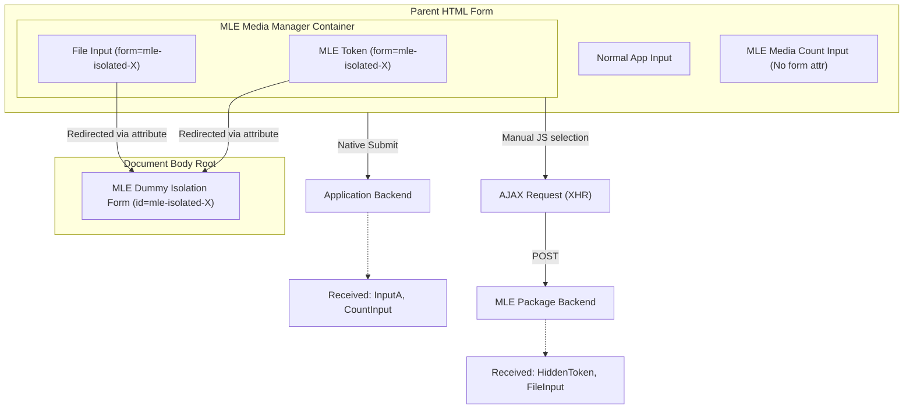

# Requirements

### Overview & Goals
The goal is to automatically isolate Media Library Extensions (MLE) components when they are nested inside a parent `<form>`. By default, internal MLE inputs (like tokens, instance IDs, and file inputs) will be redirected to a hidden dummy form using the HTML `form` attribute. This prevents these fields from being submitted to the application's primary backend while ensuring the "media count" remains available for parent form validation. The isolation target form is automatically managed by the component's internal JavaScript, requiring zero configuration or layout changes from the developer.

### Functional Requirements
- **Default Isolation**: Every Media Manager instance must automatically redirect its internal fields to a separate context.
- **Selective Exposure**: The "media count" input (used for Laravel validation) must remain bound to the parent form.
- **AJAX Compatibility**: The package's internal XHR operations must continue to function normally.
- **Zero Configuration**: No additional props or options should be required from the developer to enable this behavior.

# Technical Design: Automated Form Redirection

### Current Implementation
The Media Manager renders several hidden inputs and sub-forms. When placed inside a parent `<form>`, all these inputs are natively submitted with that form.

### The "Form Redirection" Mechanism
We leverage the HTML5 `form` attribute. When an input has a `form="some-id"` attribute, the browser associates it with the form having that ID, regardless of where the input is physically located in the DOM.

**Key Components:**
1.  **Automated Isolation Target**: Instead of requiring manual `@push` or `@stack` directives, the package's JavaScript (`media-manager-submitter.js`) automatically ensures a hidden `<form id="mle-isolated-{{ $id }}">` exists at the root of the document body for every manager instance.
2.  **Selective Redirection**: 
    - Internal fields (e.g., `client_token`, `mle_instance_ids[]`, file inputs) receive the `form="mle-isolated-{{ $id }}"` attribute.
    - The "media count" field (reporting the number of items) **omits** this attribute, keeping it part of the parent form.
3.  **AJAX Logic**: The package's JavaScript manually selects inputs within the component's container to build its `FormData` for AJAX requests. This manual selection ignores the `form` attribute, allowing AJAX to continue working perfectly.

### Architecture Diagram

### Proposed Changes

#### PHP Components
- **`MediaManager` Component**:
    - Automatically generate a unique `isolationFormId` based on the component's unique ID.
    - Add `isolationFormId` to the component's `resolveConfig` call so it's available to the JavaScript.

#### JavaScript
- **`media-manager-submitter.js`**:
    - On initialization, read the `isolationFormId` from the component config.
    - Ensure a dummy `<form>` with that ID exists in `document.body` (creating it if necessary).

#### Blade Views
- **`media-manager.blade.php`**: 
    - Apply `form="{{ $isolationFormId }}"` to `client_token` and `mle_instance_ids[]`.
- **`partial/upload-form.blade.php`**: 
    - Apply `form="{{ $isolationFormId }}"` to the file input and all hidden collection/model fields.
- **`partial/destroy-form.blade.php`**: 
    - Apply `form="{{ $isolationFormId }}"` to all internal hidden inputs.

# Security Analysis

### 1. Data Integrity
By isolating these fields, we prevent "parameter pollution" where the application's backend might receive unexpected keys like `client_token` or `media[]`. This ensures that your business logic only processes the data it expects (e.g., the media count).

### 2. XSRF Protection
Since isolation only affects the *native* form submission of the parent form, the Media Manager's AJAX requests continue to use their own CSRF tokens and headers. There is no risk of cross-talk or token invalidation.

# Testing

### Validation Approach
I will verify that the parent form's payload is clean while the Media Manager remains fully functional.

### Key Scenarios
1. **Payload Inspection**: Submit a parent form containing an MLE component and verify via DevTools that only the media count is present in the `POST` body.
2. **AJAX Upload**: Verify that files can still be uploaded and previews updated (confirming manual JS selection works).
3. **Multiple Managers**: Place two Media Managers in one form and ensure they each point to their own unique isolation form.

# Delivery Steps

###   Step 1: Implement isolation ID generation in PHP
Update the component logic to provide a unique target for isolation.

- Update `MediaManager.php` to generate `$isolationFormId = 'mle-isolated-' . $this->id`.
- Ensure this ID is passed to all sub-views (upload form, destroy form).

###   Step 2: Implement JS-managed isolation targets
Ensure the dummy forms are present in the DOM without requiring layout changes.

- Update `media-manager-submitter.js` to read `isolationFormId` from the component configuration.
- Implement a helper function to check for the form's existence on `document.body` and append it if missing.
- This ensures that the `form` attribute has a valid target as soon as the component initializes.

###   Step 3: Update Blade templates for selective redirection
Apply the `form` attribute to internal fields while sparing the count input.

- Modify `media-manager.blade.php` to apply the attribute to housekeeping inputs.
- Modify `upload-form.blade.php` and `destroy-form.blade.php` to apply the attribute to all their inputs and buttons.
- Ensure the `name="{{ $name }}"` input in `media-manager.blade.php` remains untouched.