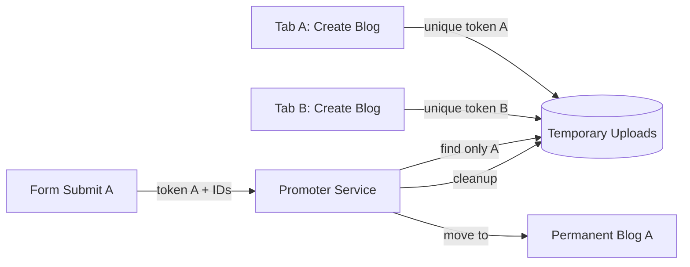

# Requirements

### Overview & Goals
The goal is to provide a comprehensive and reliable testing and implementation strategy for the media library's integration, specifically focusing on the lifecycle of temporary uploads in complex scenarios like blog CRUDs.

### Scope
- **In Scope**:
    - Tab isolation for temporary uploads.
    - Preventing leakage of temporary media into display-only components (Carousels).
    - Hardening the `TemporaryUploadPromoter` to ensure only correct files are attached to models.
    - Automated verification of the "no orphaned uploads" requirement.
- **Out of Scope**:
    - Major refactoring of the underlying Spatie MediaLibrary.
    - Changing the fundamental UI of the Media Manager.

# Technical Design

### Current Implementation
- `client_token` is stored in `localStorage` and `forever` cookies, causing it to be shared across all tabs and windows in a browser.
- `MediaCarousel` and `MediaRetriever` default to including temporary uploads, which can lead to "ghost" images appearing in display components.
- `TemporaryUploadPromoter` uses a "Broad Scan" that might pick up unrelated media if they share the same `model_type` and `client_token`.

### Proposed Changes

#### 1. Tab Isolation via `sessionStorage`
By switching the client-side token storage to `sessionStorage`, we ensure that each tab has its own unique `client_token` by default. This is the most effective way to prevent cross-tab interference when creating multiple blogs simultaneously.

#### 2. Strict Display Logic
Display components like `MediaCarousel` should focus on permanent media. We will change the default behavior to exclude temporary uploads. If a developer specifically wants a preview carousel, they will need to opt-in.

#### 3. Targeted Promotion
The `TemporaryUploadPromoter` will be updated to prioritize explicit `instance_id` matches. The "Broad Scan" (which searches by `model_type`) will only be used if it can be guaranteed that the media belongs to the current "work unit."

#### 4. Lifecycle Verification
We will add automated checks to our browser tests to ensure:
- `mle_temporary_uploads` table is clean after promotion.
- Physical files are deleted from the `temporary` disk.
- Carousel components on `show` pages do not contain any `TemporaryUpload` instances.

### Architecture Diagram

# Testing

### Validation Approach
We will use Pest Browser (Playwright) to simulate real-world user interactions and verify the backend state.

### Key Scenarios
1. **The Multi-Tab Test**:
    - Open Tab A and Tab B.
    - Upload "Image A" in Tab A.
    - Verify "Image A" does NOT appear in Tab B's media manager.
    - Save Tab A.
    - Verify Tab B still has its own state (empty) and Tab A has "Image A" permanently attached.

2. **The Carousel Leakage Test**:
    - Upload an image to a temporary manager on a "Create" page.
    - In a separate tab (or the same one), visit a "Show" page for an existing blog.
    - Assert that the Carousel on the "Show" page does NOT show the unsaved image from the "Create" page.

3. **The Orphanage Test**:
    - Perform a full Create cycle in `BlogIntegrationTest`.
    - Query the `mle_temporary_uploads` table directly from the test.
    - Assert `count()` is 0 for that `client_token`.

# Delivery Steps

### ✓ Step 1: Implement tab isolation for client tokens
Isolate temporary uploads to the current browser tab to prevent cross-tab interference.
- Modify `resources/js/shared/client-token.js` to use `window.sessionStorage` instead of `localStorage`.
- Update `src/Support/ClientContext.php` to use session-based cookies instead of `forever` cookies for `mle_client_token`.
- Rebuild JS assets using `npm run build` to apply the change.

### ✓ Step 2: Prevent temporary upload leakage in display components
Ensure display components stay clean and do not show temporary uploads by default.
- Update `src/View/Components/MediaCarousel.php` to default `includeTemporaryUploads` to `false`.
- Modify `src/Services/MediaRetriever.php` to ensure `resolveMediaFromCollections` correctly honors the `includeTemporaryUploads` flag across all components.
- Audit other display components (e.g. `MediaViewer`) for similar leakage points.

### ✓ Step 3: Strengthen TemporaryUploadPromoter logic
Refine the promotion logic to be stricter and more predictable.
- Update `src/Services/TemporaryUploadPromoter.php` to prioritize provided `instance_id`s over "Broad Scan" results.
- Add logging to track exactly why a file was or wasn't promoted during the `created`/`updated` hooks.
- Ensure that the cleanup process for promoted files is verified and covers both DB records and physical storage.

### ✓ Step 4: Implement comprehensive scoping and lifecycle tests
Create a robust suite of tests to verify all user concerns.
- Create `tests/Browser/ScopingAndIsolationTest.php` to verify that temporary uploads are isolated between different components and browser tabs.
- Add assertions to `tests/Browser/BlogIntegrationTest.php` to verify the complete removal of `mle_temporary_uploads` records after successful blog creation.
- Add a test case specifically verifying that display carousels do not show temporary uploads from other active sessions/tabs.