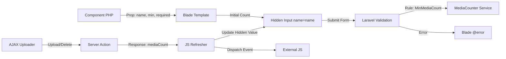

# Requirements

### Overview & Goals
The goal is to extend the `laravel-medialibrary-extensions` package to support minimum media requirements. This includes adding a `required` attribute (enforcing at least one item) and a `min` attribute (enforcing at least N items). The solution will integrate with native Laravel form validation, allowing developers to use standard rules like `required` or `min:2` by associating them with a specific manager via a new `name` property.

### Scope
- **In Scope**:
  - Adding `min`, `required`, and `name` properties to Media Manager components.
  - Automatic rendering of a hidden input with the media count when a `name` is provided.
  - Real-time synchronization of the hidden count field via JavaScript.
  - Visual indicators (e.g., asterisk) for required media.
  - A secure `MinMediaCount` server-side validation rule.
  - Displaying Laravel validation errors directly on the component.
- **Out of Scope**:
  - Client-side blocking of form submission via HTML5 `required` attribute (relying on Laravel validation).
  - Enforcing requirements for non-manager components.

### User Stories
- **As a developer**, I want to add `required` to a media manager so that users must upload at least one image.
- **As a developer**, I want to use standard Laravel validation rules (e.g. `min:3`) on a specific media manager by giving it a `name`.
- **As a user**, I want to see an asterisk and an error message if I haven't uploaded enough images.
- **As a developer**, I want to ensure that the minimum count requirement is verified securely on the server.

### Functional Requirements
- Components must accept `min` (int), `required` (bool), and `name` (string) props.
- If `name` is provided, a hidden input `<input type="hidden" name="{name}" value="{count}">` must be rendered.
- The hidden input's value must be updated via AJAX whenever media is added or removed.
- The component must display validation errors associated with its `name`.
- A visual indicator (asterisk) must be shown if `required` is true or `min > 0`.
- A `MinMediaCount` rule must be available to validate requirements securely on the server.

# Technical Design

### Current Implementation
The package handles maximum limits via `maxMediaCount` and the `ChecksMediaLimits` trait. It tracks `totalMediaCount` in PHP and synchronizes it with the frontend via the `getConfig()` payload. Limits are enforced during the AJAX upload phase.

### Key Decisions
1. **Consistency with Max**: While `max` limits are enforced during the AJAX upload phase (preventing an invalid state from reaching the server), `min` requirements can only be fully verified at the point of final form submission. This justifies the addition of a form-submittable field for `min` that does not exist for `max`.
2. **The `name` Property for Precise Validation**: The `name` property is essential to include the count in the Laravel Request. By allowing developers to specify a `name` (e.g., `name="gallery"`), we enable unique hooks for validation rules (e.g., `'gallery' => 'min:3'`) and ensure that error messages are correctly mapped back to the corresponding component in multi-manager forms.
3. **Secure Server-Side Rule**: The `MinMediaCount` rule will ignore the client-provided count and verify the actual media count in the database/temporary storage using the `client_token` and `instanceId`.

### Proposed Architecture
The implementation follows the existing pattern for `maxMediaCount`.

### File Changes
- **PHP Components**:
  - `src/View/Components/BaseMediaComponent.php`: Add `minMediaCount`, `required`, and `name`.
  - `src/View/Components/MediaManager.php`: Resolve `minMediaCount`, `required`, and `name` and sync to config.
  - `src/View/Components/MediaManagerSingle.php` & `MediaManagerMultiple.php`: Accept new props in constructor.
- **Blade Views**:
  - `resources/views/components/plain/media-manager.blade.php`:
    - Render hidden count field `<input type="hidden" name="{{ $name }}">` if `name` is present.
    - Add visual "Required" indicator (asterisk).
    - Add `@error($name)` block to display Laravel validation errors.
- **JavaScript**:
  - `resources/js/shared/media-manager-previews-refresher.js`: Update the hidden field value after AJAX refresh; include `mediaCount` in event detail.
- **Validation**:
  - `src/Rules/MinMediaCount.php`: New validation rule mirroring `MaxMediaCount`, checking both permanent and temporary storage.
- **Lang**:
  - `lang/en/messages.php`: Add `at_least_one_medium_required` and `this_collection_requires_at_least_:items_items`.

### Recommendation on "Advise against this"
I strongly advise **in favor** of this implementation. Minimum requirements are a standard feature in CMS and form-heavy applications. Implementing it this way (generalizing to `min`) is future-proof and aligns perfectly with the existing `max` logic already present in the package.

# Testing

### Validation Approach
Verification will ensure that the `min` prop correctly influences the UI and that the hidden field stays in sync with actual uploads.

### Key Scenarios
1. **Initial State**: A component with `min="2"` should show "0 of 2 required" (or similar) and the hidden input should be `0`.
2. **AJAX Upload**: After uploading 1 file, the hidden input should update to `1`.
3. **Requirement Met**: After uploading a 2nd file, the UI should indicate the requirement is met, and the hidden input should be `2`.
4. **Deletion**: Deleting a file should decrement the hidden input value and update the UI accordingly.
5. **Server Validation**: Attempting to save a form with only 1 file when `MinMediaCount(2)` is applied should fail validation.

### Edge Cases
- **Multiple Collections**: Ensure `min` applies to the total count across all collections handled by the manager (matching `max` behavior).
- **Model vs Temporary**: The `MinMediaCount` rule must correctly sum existing model media and new temporary uploads.
- **Standalone Managers**: Verify that the `mediaManagerPreviewsUpdated` event provides the correct `mediaCount` for external logic.

# Delivery Steps

### ✓ Step 1: Extend PHP components with minMediaCount and name support
Generalize the requirement concept into `minMediaCount`, `required`, and `name` properties.

- Add `public int $minMediaCount = 0`, `public bool $required = false`, and `public ?string $name = null` to `BaseMediaComponent`.
- Update `MediaManager` constructor to accept `min`, `required`, and `name`.
- Logic: If `required` is true and `min` is 0, set `minMediaCount` to 1.
- Update `MediaManager::setDisableFormOption` to include these in the component's resolved configuration.
- Add `at_least_one_medium_required` and `this_collection_requires_at_least_:items_items` to the language files.

### ✓ Step 2: Enhance Blade templates with hidden count fields and indicators
Expose the current media count in the DOM for native validation and provide visual feedback.

- In `resources/views/components/plain/media-manager.blade.php`, add a hidden input: `<input type="hidden" name="{{ $name }}" value="{{ $totalMediaCount }}" data-mle-media-count="{{ $id }}">` (only if `$name` is set).
- Add a visual indicator (e.g., an asterisk `*`) next to the media counts label when `required` is true or `minMediaCount > 0`.
- Add `@error($name)` block to display Laravel validation errors.

### ✓ Step 3: Implement JavaScript synchronization for media counts
Ensure the hidden field and custom events reflect real-time changes during AJAX operations.

- Update `resources/js/shared/media-manager-previews-refresher.js` to update the `data-mle-media-count` input value.
- Include `mediaCount` in the `mediaManagerPreviewsUpdated` event detail.

### ✓ Step 4: Implement MinMediaCount validation rule
Provide a secure way to enforce minimum media requirements on the server side.

- Create a new `MinMediaCount` validation rule that uses the `MediaCounter` service.
- The rule will check both permanent media and temporary uploads using `client_token` and `instanceId`.
- Example usage: `'gallery' => [new MinMediaCount($model, $collections, 2)]`.

### ✓ Step 5: Implement browser tests for the new functionality
Verify UI indicators, live count synchronization, and server-side validation in a real browser environment.

- Update the demo page and `StoreAlienRequest` to include a "Min 2 Required" scenario.
- Create `tests/Browser/MediaManagerMinMediaTest.php` to cover:
    - Asterisk presence.
    - Real-time hidden count input updates after AJAX uploads.
    - Server-side validation failure when requirements are not met.
    - Successful form submission when requirements are met.
- Ensure tests pass across different themes (Bootstrap 5 and Plain).