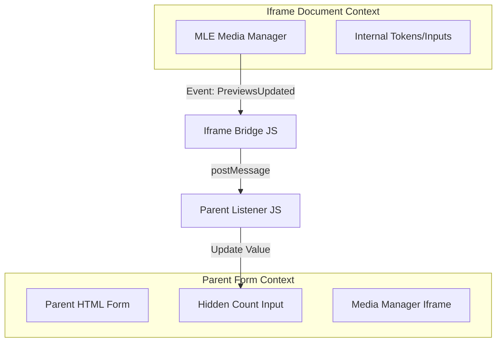
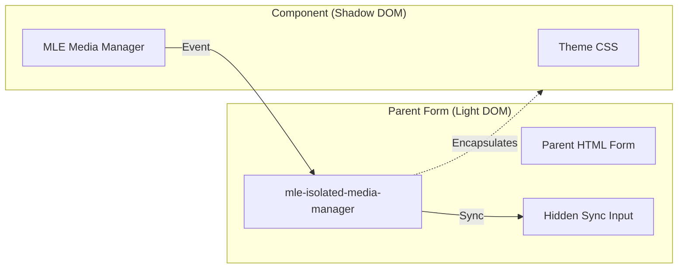
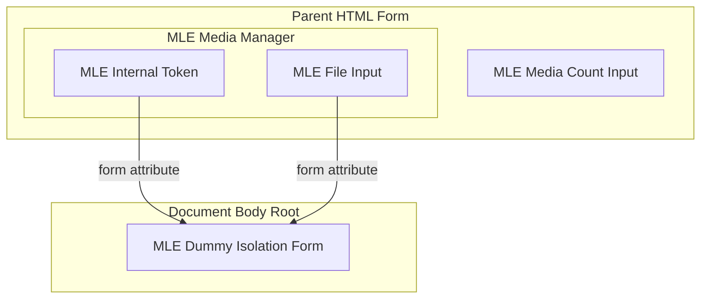

# Requirements

### Overview & Goals
The goal is to provide a way to isolate Media Library Extensions (MLE) components when they are nested inside a parent `<form>`. Currently, internal MLE inputs (like tokens, instance IDs, and file inputs) are submitted with the parent form, which can cause backend validation errors or unexpected data in the main application request.

### Functional Requirements
- **Isolation**: Prevent internal MLE fields (tokens, instance IDs, file inputs) from being submitted with a parent form.
- **Exposure**: Ensure the "media count" input remains part of the parent form context for validation.
- **XHR Support**: Maintain existing AJAX (XHR) operations for uploads and deletions.
- **Developer Choice**: Provide multiple isolation strategies depending on styling and robustness needs.

# Method 1: Iframe Isolation

### Technical Design
Method 1 uses an `<iframe>` to create a new document context. The parent form only "sees" the `<iframe>` tag and a hidden input that we manually sync via the `postMessage` API.

**Key Decisions:**
- **New Wrapper Route**: `GET /mlbrgn-mle/media-manager-iframe` served by `MediaManagerController@iframe` using a new `GetMediaManagerIframeAction`.
- **Dedicated View**: `resources/views/media-manager-iframe.blade.php` renders a minimal HTML boilerplate containing only the Media Manager component.
- **PostMessage Bridge**: The iframe listens for the `mediaManagerPreviewsUpdated` event and uses `window.parent.postMessage` to relay the `mediaCount` and `instanceId` to the parent window.
- **Hidden Sync Input**: The parent component `<x-mle-media-manager-iframe>` renders a hidden input with `data-mle-iframe-sync` to receive and store the synced count.

**Architecture Diagram:**


# Method 2: Shadow DOM Isolation

### Technical Design
Method 2 encapsulates the Media Manager within a **Shadow DOM** using a **Custom Element**. This approach keeps the component on the same page but physically separates its form fields from the parent document's form submission.

**Key Decisions:**
- **Custom Element Wrapper**: Define a new Custom Element `<mle-isolated-media-manager>` that initializes a Shadow Root in `mode: 'open'`.
- **Root-Scoped JS**: Refactor the package's internal JavaScript (e.g., in `medialibrary-extensions.js`) to support root-scoped element selection (`this.shadowRoot.querySelectorAll`) instead of global document selection.
- **Style Injection**: The component dynamically injects the package's CSS (including theme-specific styles) into the Shadow Root using `<link>` tags or CSS injection to ensure consistent rendering.
- **Light DOM Sync**: The Custom Element relays `mediaManagerPreviewsUpdated` events to the Light DOM to update a hidden sync input associated with the parent form.

**Architecture Diagram:**


# Method 3: HTML5 Form Attribute (Integrated)

### Technical Design
Method 3 leverages the HTML `form` attribute to redirect internal inputs to a dummy form. By explicitly associating inputs with a form ID that exists elsewhere in the document, the browser will not include them when submitting the parent `<form>`.

**Key Decisions:**
- **Component Logic**: 
    - Add `isolate` to the `configKeys` and `getDefaultOptions` in the `InteractsWithOptionsAndConfig` trait.
    - Update the `MediaManager` constructor to generate a unique `isolationFormId` (e.g., `mle-isolated-{$id}`).
- **View Redirection**:
    - **`media-manager.blade.php`**: Apply the `form` attribute to `client_token` and `mle_instance_ids[]`.
    - **`partial/upload-form.blade.php`**: Apply the `form` attribute to the file input and collection/model hidden fields.
    - **`partial/destroy-form.blade.php`**: Apply the `form` attribute to internal hidden inputs.
- **Out-of-Form Rendering**: Instead of rendering the dummy form inside the component (which would still be nested), use Laravel's `@push` directive to render the `<form id="{{ $isolationFormId }}" style="display:none"></form>` into a `@stack('mle-isolation-forms')` located before the closing `</body>` tag.
- **Selective Exposure**: Explicitly skip the `form` attribute for the "media count" input in `media-manager.blade.php` so it remains bound to the parent form.

**Architecture Diagram:**


# Method 4: HTML5 Form Attribute (Zero-Code JS)

### Technical Design
Method 4 uses the same `form` attribute technology but applies it entirely via client-side JavaScript. This is ideal if you want to avoid modifying the package's PHP or Blade files.

**Key Decisions:**
- **Dynamic Form Creation**: A global JS script runs on `DOMContentLoaded`. It creates a single hidden `<form id="mle-global-isolation-form"></form>` and appends it to the document body.
- **Automatic Association**: The script identifies all elements with `[data-mle-media-manager]`. It finds all `input`, `select`, and `textarea` elements within these containers.
- **Filtering**: It skips any input with the `data-mle-media-count` attribute to ensure the count is still submitted with the parent form.
- **Attribute Injection**: It programmatically sets the `form` attribute on all other discovered internal fields to `mle-global-isolation-form`.

**Example JS Snippet:**
```javascript
document.addEventListener('DOMContentLoaded', function() {
    const dummy = document.createElement('form');
    dummy.id = 'mle-global-isolation-form';
    dummy.style.display = 'none';
    document.body.appendChild(dummy);
    
    document.querySelectorAll('[data-mle-media-manager]').forEach(manager => {
        manager.querySelectorAll('input, select, textarea').forEach(field => {
            if (!field.hasAttribute('data-mle-media-count')) {
                field.setAttribute('form', 'mle-global-isolation-form');
            }
        });
    });
});
```

# Method 5: Form Data Filtering (JS API)

### Technical Design
Method 5 uses the modern `formdata` event to filter out MLE-specific fields just before the browser sends the form data. This approach is non-destructive to the DOM.

**Key Decisions:**
- **Event Listener**: Attach a global `formdata` event listener to the `document` (capturing phase) or specifically to parent forms.
- **Data Deletion**: When the event fires, the script iterates through the `FormData` entries and removes any keys that match MLE internal fields (e.g., `client_token`, `mle_instance_ids[]`).
- **Targeted Filtering**: Only fields located inside a `[data-mle-media-manager]` container are removed, unless they have the `data-mle-media-count` attribute.

**Example JS Snippet:**
```javascript
window.addEventListener('formdata', (e) => {
    const formData = e.formData;
    const mediaManagers = document.querySelectorAll('[data-mle-media-manager]');
    
    mediaManagers.forEach(manager => {
        const internalInputs = manager.querySelectorAll('input, select, textarea');
        internalInputs.forEach(input => {
            if (!input.hasAttribute('data-mle-media-count')) {
                // Remove this specific input's value from the submission
                formData.delete(input.name);
            }
        });
    });
});
```

# Method 6: Submission Interception (Temporary Disabling)

### Technical Design
Method 6 intercepts the parent form's `submit` event and temporarily disables all MLE-specific inputs. Since disabled inputs are never included in native form submissions, they are effectively isolated.

**Key Decisions:**
- **Submit Listener**: Listen for the `submit` event on any form containing a Media Manager.
- **Temporary Disable**: Set `disabled = true` on all internal MLE inputs.
- **Auto Re-enable**: Use a `setTimeout` or a `requestAnimationFrame` to re-enable the inputs immediately after the submission cycle starts, ensuring they remain functional for the user.

**Example JS Snippet:**
```javascript
document.addEventListener('submit', (e) => {
    const form = e.target;
    const mleInputs = form.querySelectorAll('[data-mle-media-manager] input, [data-mle-media-manager] select');
    
    mleInputs.forEach(input => {
        if (!input.hasAttribute('data-mle-media-count')) {
            input.dataset.mleWasDisabled = input.disabled;
            input.disabled = true;
        }
    });

    // Re-enable after the current execution loop finishes
    setTimeout(() => {
        mleInputs.forEach(input => {
            if (input.dataset.mleWasDisabled !== undefined) {
                input.disabled = input.dataset.mleWasDisabled === 'true';
                delete input.dataset.mleWasDisabled;
            }
        });
    }, 0);
});
```

# Comparison of Methods

| Feature | Method 1: Iframe | Method 2: Shadow DOM | Method 3: Form Attribute | Method 5: Form Data Event | Method 6: Disable on Submit |
| :--- | :--- | :--- | :--- | :--- | :--- |
| **Isolation Goal** | Complete Doc Isolation | Component Encapsulation | Form Redirection | Payload Filtering | Native Exclusion |
| **Implementation** | Complex (Routes) | Moderate (JS Refactor) | **Simple (Native HTML)** | Simple (JS API) | Simple (JS Hack) |
| **Performance** | Slower (Extra HTTP) | Fast | **Fastest (Native)** | Fast | Fast |
| **Visual Styling** | Perfect (Isolated) | Isolated (Encapsulated) | Shared (Leaky) | Shared (Leaky) | Shared (Leaky) |
| **Maintenance** | High (Layout Sync) | Moderate | **Low (HTML Core)** | Low | Low |
| **Compatibility** | All Browsers | Modern (v1) | All Modern | Safari 13.1+, Chrome 77+ | **All Browsers** |

### Detailed Pros and Cons

#### Method 1: Iframe Isolation
- **Pros**: Strongest isolation (CSS, JS, DOM). No risk of parent scripts interfering.
- **Cons**: Difficult to sync height. Requires extra HTTP requests and routes.

#### Method 2: Shadow DOM
- **Pros**: Clean encapsulation. Native browser support for form exclusion.
- **Cons**: Requires refactoring package JS to use `shadowRoot`. CSS must be re-injected.

#### Method 3: Form Attribute (Recommended)
- **Pros**: **Zero JS required** for the redirection itself. Native browser behavior. Extremely reliable.
- **Cons**: No visual isolation (CSS leaks). Requires the presence of a dummy form in the DOM.

#### Method 5: Form Data Filtering
- **Pros**: Non-destructive. Doesn't move elements or change attributes. Very clean for modern browsers.
- **Cons**: Browser support (Safari 13.1+). Requires JS. If the `name` attribute is used elsewhere, `formData.delete(name)` might remove unintended fields if not targeted carefully.

#### Method 6: Disable on Submit
- **Pros**: **Universal compatibility**. Works everywhere JS is supported. Very easy to drop into existing projects.
- **Cons**: Feels like a "hack". Can be tricky if other scripts also listen to `submit`. Might cause issues if the user clicks "Back" after submission.

### Recommendation
For your specific need to **isolate form data while keeping the UI integrated**, **Method 3 (HTML5 Form Attribute)** is highly recommended. It is the most robust and least intrusive way to ensure your parent form never receives MLE internal data, without the overhead of iframes or the JS complexity of Shadow DOM.

# Security Analysis

### 1. CSRF Protection
All methods maintain Laravel's CSRF protection. MLE AJAX requests use the `X-CSRF-TOKEN` header, while the parent form uses its own `@csrf` token. Isolation ensures these tokens do not conflict or get sent to the wrong backend endpoints.

### 2. XSS (Cross-Site Scripting)
- **Iframe**: Provides a hard security boundary. Scripts in the parent cannot easily access the iframe context (Same-Origin Policy applies if origins differ, but even on same origin, they are separate documents).
- **Shadow DOM**: Provides DOM isolation, but not a security boundary. A malicious script in the parent can still access the `shadowRoot` (if open) and manipulate internal inputs.
- **Form Attribute**: No XSS isolation. The inputs are in the main DOM and accessible to all scripts. However, XSS protection should be handled globally via sanitization and CSP, not via form isolation.

### 3. Data Leakage
The primary "security" benefit here is preventing **Accidental Data Submission**. By isolating the forms, you ensure that sensitive tokens (`client_token`, `instance_id`) and large file uploads are only sent to the MLE backend and never leaked to your application's business logic backend, preventing unintended side effects or validation bypasses.

# Testing

### Validation Approach
Verify isolation by checking the `multipart/form-data` payload of the parent form submission.

### Key Scenarios
1. **Isolation Verification**: Submit the parent form and ensure `client_token` and other internal fields are missing from the request.
2. **Count Synchronization**: Verify the media count is correctly received by the parent form backend.
3. **AJAX Integrity**: Ensure that uploading a file still triggers the correct AJAX requests and refreshes the preview grid.

# Delivery Steps

###   Step 1: Implement isolation logic in PHP components
Define the `isolate` property and handle `isolationFormId` generation.

- Add `isolate` to `InteractsWithOptionsAndConfig` trait's `configKeys` and `getDefaultOptions`.
- Update `MediaManager` constructor to accept `isolate` and store it in options.
- Generate a unique `isolationFormId` (e.g., `mle-isolated-{$id}`) when `isolate` is enabled.
- Ensure `isolate` and `isolationFormId` are propagated to sub-components via the `config` array.

###   Step 2: Update Blade templates for form isolation
Update all media manager templates to use the `form` attribute for isolation.

- Update `media-manager.blade.php` to apply `form` attribute to base internal inputs (instance IDs, client tokens).
- Update `partial/upload-form.blade.php` to apply `form` attribute to file inputs and collection fields.
- Update `partial/destroy-form.blade.php` and `partial/youtube-upload-form.blade.php` to apply `form` attribute to their hidden fields and submit buttons.
- Ensure the "media count" input in `media-manager.blade.php` DOES NOT receive the `form` attribute, keeping it bound to the parent form.

###   Step 3: Render the dummy isolation form
Add the target form for isolated inputs to the DOM.

- Update `media-manager.blade.php` to push the isolation form to a stack: `@push('mle-isolation-forms') <form id="{{ $isolationFormId }}" style="display:none"></form> @endpush`.
- Ensure the user's layout file includes `@stack('mle-isolation-forms')` before the closing `</body>` tag.
- Verify that multiple instances of the media manager on the same page have unique isolation forms.